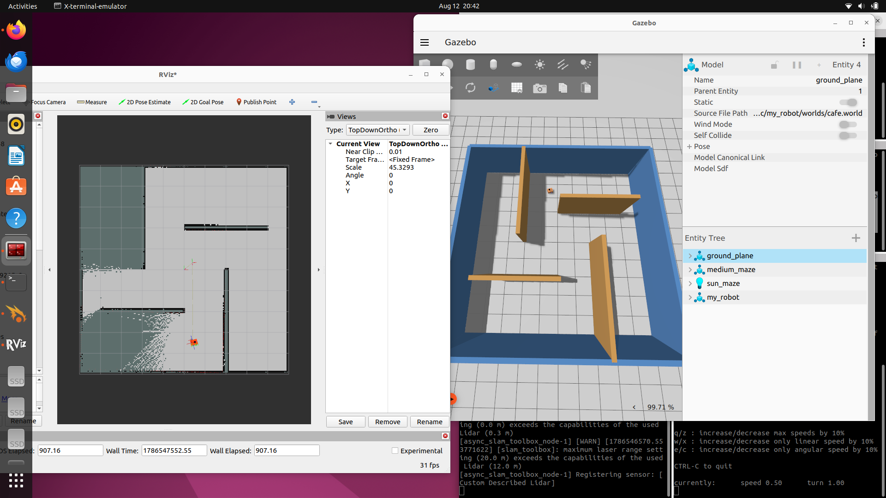

# ROS 2 Mobile Robot — SLAM & Autonomous Navigation

A differential-drive mobile robot built with **ROS 2 Humble** that performs **2D SLAM mapping**, **AMCL localization**, and **autonomous navigation with Nav2** inside a custom Gazebo Cafe environment. The robot is described in URDF/Xacro, driven through `ros2_control` with a differential-drive controller, and equipped with simulated LiDAR, camera and depth camera sensors.

The entire workflow demonstrated in this repository — mapping, map saving, localization and goal-based navigation — was validated in simulation on Ubuntu 22.04.

---

## Project Demo

The demonstration covers the complete autonomy pipeline:

1. Spawn the differential-drive robot in a custom Cafe world in Gazebo.
2. Build a 2D occupancy grid map using SLAM Toolbox while driving the robot with keyboard teleoperation.
3. Save the generated map to disk.
4. Reload the saved map and localize the robot using AMCL.
5. Send a goal pose from RViz2 and let Nav2 plan and execute the path autonomously.

### Gazebo Simulation and SLAM Mapping



The image shows the robot inside the Gazebo Cafe world alongside the RViz2 view of the occupancy grid being built in real time by SLAM Toolbox.

---

## Autonomous Navigation Demo

A recorded demonstration shows the robot receiving a destination through the **2D Goal Pose** tool in RViz2. Nav2 computes a global path over the saved Cafe map, the local controller follows that path while avoiding obstacles, and the robot drives autonomously to the selected destination.

[▶️ Watch the Autonomous Navigation Demo]((https://drive.google.com/drive/folders/1nQtYTKX7BpPHDnkdo-Ptr60J_1BOaMb2?usp=sharing))


---

## Features

**Demonstrated in simulation**

- Differential-drive mobile robot spawned in a custom Gazebo Cafe world
- 2D SLAM mapping with SLAM Toolbox using simulated LiDAR
- Keyboard teleoperation via `teleop_twist_keyboard`
- Map saving with `nav2_map_server`
- AMCL localization on the saved map
- Autonomous point-to-point navigation with Nav2
- Live visualization in RViz2 (map, laser scan, TF, robot model)

**Included in the repository**

- URDF/Xacro robot description with modular macros
- `ros2_control` integration with a differential-drive controller
- Camera and depth camera sensor descriptions and launch files
- `twist_mux` for velocity command arbitration
- Joystick teleoperation configuration
- RPLidar driver launch file for physical hardware
- Ball tracker configuration for simulation and real robot
- Multiple worlds: Cafe, empty and obstacle environments

---

## System Workflow

```text
Gazebo Simulation
        ↓
LiDAR + TF
        ↓
SLAM Toolbox
        ↓
Saved Map
        ↓
AMCL Localization
        ↓
Nav2
        ↓
Path Planning + Controller
        ↓
Differential Drive Controller
        ↓
Robot Motion
```

Each stage feeds the next: the simulator publishes sensor data and transforms, SLAM turns those into a map, the map is saved and reused for localization, and Nav2 uses the localized pose plus the map to plan and execute motion.

---

## System Architecture

| Layer | Component | Role |
|---|---|---|
| Simulation | Gazebo (Ignition Fortress) | Physics, world, sensor simulation |
| Description | URDF / Xacro | Robot links, joints, sensors, inertias |
| Control | `ros2_control` + `diff_drive_controller` | Converts velocity commands into wheel motion |
| Perception | LiDAR (`/scan`) | Range data for mapping and obstacle avoidance |
| Mapping | SLAM Toolbox | Builds the 2D occupancy grid and `map → odom` transform |
| Localization | AMCL (`nav2_amcl`) | Estimates robot pose on a known map |
| Navigation | Nav2 | Global planner, local controller, behaviour tree, costmaps |
| Visualization | RViz2 | Map, scan, TF and goal/pose tooling |

---

## Technologies Used

- **ROS 2 Humble Hawksbill**
- **Ubuntu 22.04 LTS**
- **Gazebo / Ignition Fortress**
- **SLAM Toolbox**
- **Nav2 (Navigation2)**
- **AMCL**
- **ros2_control / diff_drive_controller**
- **RViz2**
- **URDF / Xacro**
- **Python launch files, YAML configuration**

---

## Prerequisites

- Ubuntu 22.04 LTS
- ROS 2 Humble installed and sourced
- Gazebo (Ignition Fortress) with ROS 2 integration
- A configured ROS 2 workspace (`~/ros2_ws`)

Source ROS 2 in every new terminal:

```bash
source /opt/ros/humble/setup.bash
```

---

## Installation

Clone the repository into the `src` folder of your workspace:

```bash
mkdir -p ~/ros2_ws/src
cd ~/ros2_ws/src
git clone https://github.com/nishith982/my_robot.git
```

---

## Dependency Installation

Install the ROS 2 packages used by this project:

```bash
sudo apt update
sudo apt install \
  ros-humble-slam-toolbox \
  ros-humble-navigation2 \
  ros-humble-nav2-bringup \
  ros-humble-ros2-control \
  ros-humble-ros2-controllers \
  ros-humble-twist-mux \
  ros-humble-teleop-twist-keyboard \
  ros-humble-xacro
```

Then resolve any remaining package dependencies from the workspace root:

```bash
cd ~/ros2_ws
rosdep install --from-paths src --ignore-src -r -y
```

---

## Build Instructions

```bash
cd ~/ros2_ws
colcon build --symlink-install
source install/setup.bash
```

`--symlink-install` links launch and config files instead of copying them, so edits take effect without a full rebuild.

> Source `install/setup.bash` in every terminal before running the commands below.

---

## Running the Project

The stages below are run in separate terminals and follow the order of the system workflow.

### 1. Gazebo Simulation

Launch the robot inside the custom Cafe world:

```bash
ros2 launch my_robot launch_sim.launch.py world:=/home/$USER/ros2_ws/src/my_robot/worlds/cafe.world
```

This starts Gazebo, loads the Cafe world, spawns the robot from its URDF, brings up the robot state publisher and starts the `ros2_control` controllers, including the differential-drive controller.

### 2. SLAM Mapping

With the simulation running, start SLAM Toolbox in asynchronous online mode:

```bash
ros2 launch slam_toolbox online_async_launch.py use_sim_time:=true
```

SLAM Toolbox subscribes to the LiDAR scan and TF data, incrementally builds a 2D occupancy grid and publishes the `map → odom` transform. `use_sim_time:=true` makes every node follow the simulator clock.

Open RViz2 to watch the map being built:

```bash
rviz2
```

RViz2 configuration used:

- **Fixed Frame:** `map`
- **Map** display (topic `/map`)
- **LaserScan** display (topic `/scan`)
- **TF** display
- **RobotModel** display

### 3. Teleoperation

Drive the robot around the Cafe environment so SLAM can observe the whole space:

```bash
ros2 run teleop_twist_keyboard teleop_twist_keyboard
```

This publishes `geometry_msgs/Twist` messages on `/cmd_vel` from keyboard input. Drive slowly and cover the environment fully for a clean map.

### 4. Saving the Map

Once the map looks complete, save it:

```bash
mkdir -p ~/ros2_ws/maps
ros2 run nav2_map_server map_saver_cli -f ~/ros2_ws/maps/cafe_map
```

This produces two files:

- `cafe_map.pgm` — the occupancy grid image
- `cafe_map.yaml` — metadata such as resolution, origin and thresholds

SLAM Toolbox can be shut down after the map is saved.

### 5. AMCL Localization

Restart the simulation, then load the saved map and localize against it:

```bash
ros2 launch my_robot localization_launch.py map:=/home/$USER/ros2_ws/maps/cafe_map.yaml use_sim_time:=true
```

This starts the map server and AMCL. AMCL uses a particle filter to match incoming laser scans against the static map and publishes the corrected `map → odom` transform.

In RViz2, use the **2D Pose Estimate** tool to set the robot's initial pose so the particle cloud converges near the true position.

### 6. Nav2 Autonomous Navigation

With localization running, start the navigation stack:

```bash
ros2 launch my_robot navigation_launch.py use_sim_time:=true
```

Nav2 brings up the global and local costmaps, the planner server, the controller server and the behaviour tree navigator.

In RViz2, use the **2D Goal Pose** tool to click a destination on the map. Nav2 plans a global path, the local controller tracks it while avoiding obstacles, and the resulting velocity commands drive the robot to the goal autonomously.

---

## ROS 2 Topic / Data Flow

The velocity command path exercised during teleoperation and navigation:

```text
Teleop / Nav2
      ↓
   /cmd_vel
      ↓
  twist_mux
      ↓
/diff_cont/cmd_vel
      ↓
Differential Drive Controller
      ↓
Robot
```

`twist_mux` arbitrates between multiple velocity sources by priority, so a manual teleoperation command can override autonomous output on the same robot.

Key topics and transforms:

| Topic / Frame | Description |
|---|---|
| `/scan` | LiDAR range data used by SLAM, AMCL and costmaps |
| `/cmd_vel` | Velocity commands from teleop or Nav2 |
| `/diff_cont/cmd_vel` | Velocity commands forwarded to the differential-drive controller |
| `/odom` | Wheel odometry published by the controller |
| `/map` | Occupancy grid from SLAM Toolbox or the map server |
| `map → odom` | Correction published by SLAM Toolbox or AMCL |
| `odom → base_link` | Odometry transform from the differential-drive controller |

---

## Robot Description

The robot is described in modular Xacro files under `description/`:

| File | Purpose |
|---|---|
| `robot.urdf.xacro` | Top-level description that includes all other macros |
| `robot_core.xacro` | Chassis, wheels, caster and base frames |
| `inertial_macros.xacro` | Reusable inertia macros for primitive shapes |
| `gazebo_control.xacro` | Gazebo differential-drive plugin configuration |
| `ros2_control.xacro` | `ros2_control` hardware interface definition |
| `lidar.xacro` | LiDAR link, joint and sensor plugin |
| `camera.xacro` | RGB camera link and sensor plugin |
| `depth_camera.xacro` | Depth camera link and sensor plugin |
| `face.xacro` | Cosmetic front-face geometry |

---

## Sensors

| Sensor | Status |
|---|---|
| LiDAR | Used for SLAM mapping, AMCL localization and Nav2 costmaps |
| RGB camera | Included in the robot description and launch files |
| Depth camera | Included in the robot description and launch files |
| RPLidar (hardware) | Driver launch file included for use on a physical robot |

The LiDAR is the sensor exercised throughout the demonstrated mapping, localization and navigation workflow. The camera, depth camera and RPLidar driver are included as part of the project setup.

---

## Configuration

All tunable parameters live in `config/`:

| File | Purpose |
|---|---|
| `nav2_params.yaml` | Nav2 planner, controller, costmap and behaviour-tree parameters |
| `mapper_params_online_async.yaml` | SLAM Toolbox online asynchronous mapping parameters |
| `my_controllers.yaml` | `ros2_control` controller manager and differential-drive controller settings |
| `twist_mux.yaml` | Velocity source priorities and timeouts |
| `joystick.yaml` | Joystick axis and button mapping |
| `gz_bridge.yaml` | Gazebo ↔ ROS 2 topic bridge configuration |
| `gaz_ros2_ctl_use_sim.yaml` | `ros2_control` settings for simulated hardware |
| `ball_tracker_params_sim.yaml` | Ball tracker parameters for simulation |
| `ball_tracker_params_robot.yaml` | Ball tracker parameters for the physical robot |

---

## Launch Files

| File | Purpose |
|---|---|
| `launch_sim.launch.py` | Full Gazebo simulation: world, robot spawn, controllers |
| `launch_robot.launch.py` | Bring-up for the physical robot |
| `rsp.launch.py` | Robot state publisher from the Xacro description |
| `online_async_launch.py` | SLAM Toolbox online asynchronous mapping |
| `localization_launch.py` | Map server and AMCL localization |
| `navigation_launch.py` | Nav2 navigation stack |
| `joystick.launch.py` | Joystick teleoperation |
| `camera.launch.py` | Camera driver bring-up |
| `rplidar.launch.py` | RPLidar driver bring-up |
| `ball_tracker.launch.py` | Ball tracking nodes |

---

## Project Structure

```text
my_robot/
├── config/              # Nav2, SLAM, controller, twist_mux and sensor parameters
├── description/         # URDF / Xacro robot and sensor description
├── images/              # Documentation images
├── launch/              # Python launch files
├── worlds/              # Gazebo worlds (cafe, empty, obstacles)
├── CMakeLists.txt
├── package.xml
└── README.md
```

---

## Results / What Was Demonstrated

All results below were achieved in simulation on Ubuntu 22.04 with ROS 2 Humble:

- The differential-drive robot was launched and controlled inside a custom Gazebo Cafe world.
- A complete 2D occupancy grid map of the Cafe environment was generated with SLAM Toolbox using the simulated LiDAR.
- The robot was teleoperated with `teleop_twist_keyboard` to explore and map the environment.
- The map was saved successfully as `cafe_map.pgm` and `cafe_map.yaml`.
- AMCL localized the robot on the saved map after an initial pose was supplied through RViz2.
- Nav2 accepted a goal from the RViz2 **2D Goal Pose** tool and the robot navigated autonomously to the destination.

This project has not been deployed on a physical robot; the demonstrated results are from the Gazebo simulation.

---

## Key ROS 2 Concepts Learned

- Building modular robot descriptions with URDF and Xacro macros
- The TF tree and why `map → odom → base_link` must stay consistent
- Using `ros2_control` with a differential-drive controller
- Online asynchronous SLAM and what makes a clean occupancy grid
- Particle-filter localization with AMCL and the role of the initial pose
- Nav2 architecture: costmaps, global planner, local controller, behaviour trees
- Arbitrating multiple velocity sources with `twist_mux`
- Writing and parameterizing Python launch files
- Keeping simulation time consistent across nodes with `use_sim_time`

---

## Troubleshooting

**The map does not appear in RViz2**
Set the Fixed Frame to `map` and confirm SLAM Toolbox is running and publishing on `/map`.

**Nodes appear frozen or TF timestamps look wrong**
Make sure every node is started with `use_sim_time:=true` when running in simulation.

**TF errors between frames**
Inspect the transform tree and confirm the robot state publisher and controllers are running:

```bash
ros2 run tf2_tools view_frames
```

**The robot does not move with teleoperation**
Check that commands are reaching the controller:

```bash
ros2 topic echo /cmd_vel
ros2 topic echo /diff_cont/cmd_vel
```

Also confirm the differential-drive controller is active:

```bash
ros2 control list_controllers
```

**Nav2 rejects the goal or the robot does not start moving**
Set an initial pose with the **2D Pose Estimate** tool first and verify the AMCL particle cloud has converged.

**The world does not load**
Check the world path passed to `launch_sim.launch.py` and confirm the file exists in `worlds/`.

---

## Future Improvements

- Deploy the stack on a physical differential-drive robot using the RPLidar driver
- Integrate the camera and depth camera into obstacle avoidance and perception
- Add multi-goal and waypoint-following navigation
- Tune Nav2 costmap and controller parameters for smoother trajectories
- Add joystick teleoperation as a fully tested control mode
- Explore 3D mapping and vision-based navigation

---

## Author

**Nishith**
Electronics and Robotics Engineering Student

---

## Repository

[https://github.com/nishith982/my_robot](https://github.com/nishith982/my_robot)

---

## License

No license is currently defined for this repository. The project is intended for educational and portfolio purposes.
